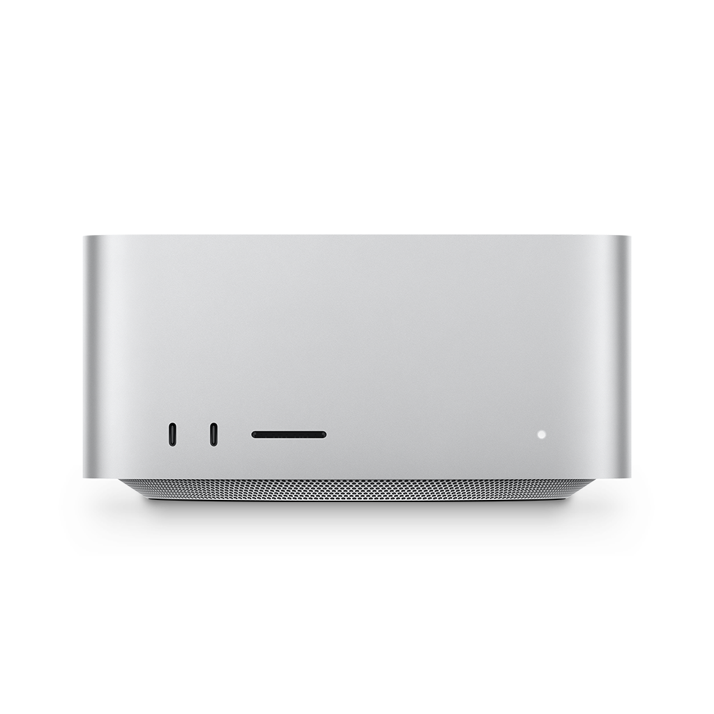

# UTTypeHardwareIcons
Getting hardware icons on macOS

## Requirements

macOS 11 Big Sur

## Usage

MacBook Pro M2 Pro/Max aka. Mac14,6:

Mac Studio M1 Max aka. Mac13,1:

iPhone 14 aka. iPhone14,7:

