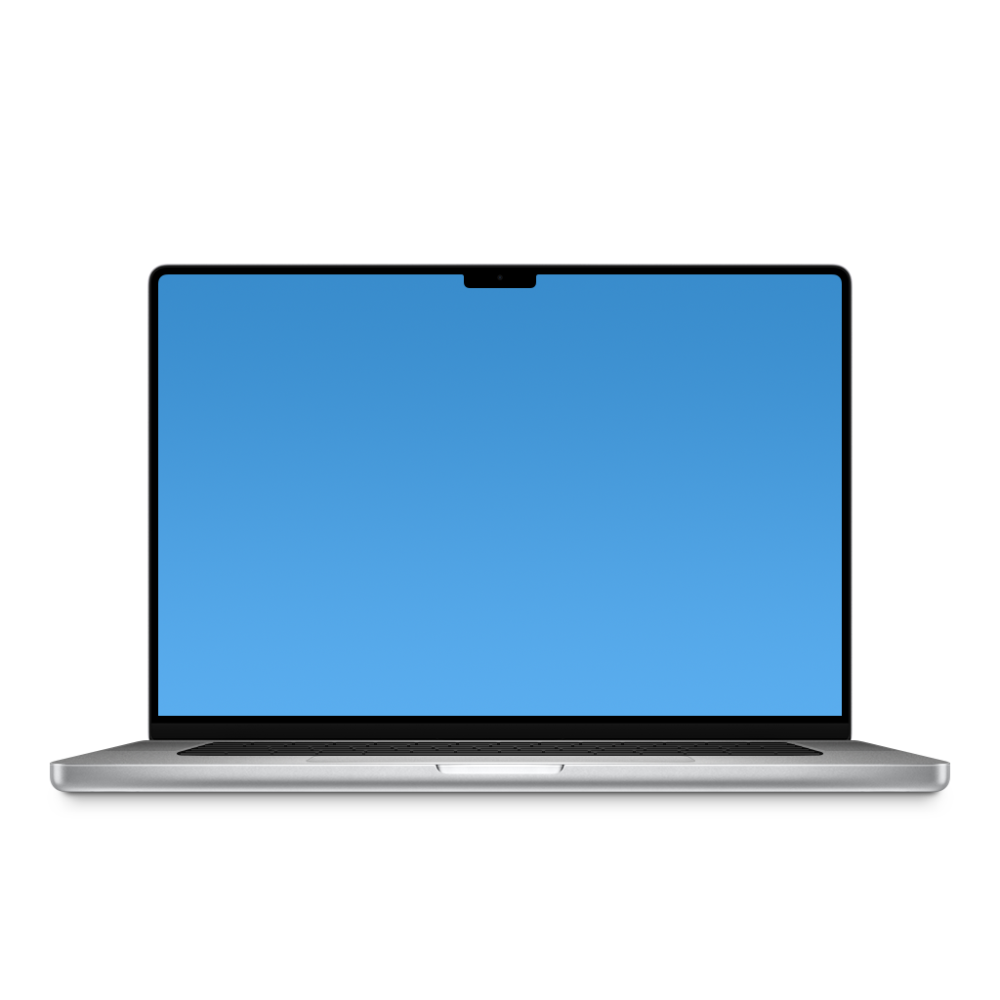
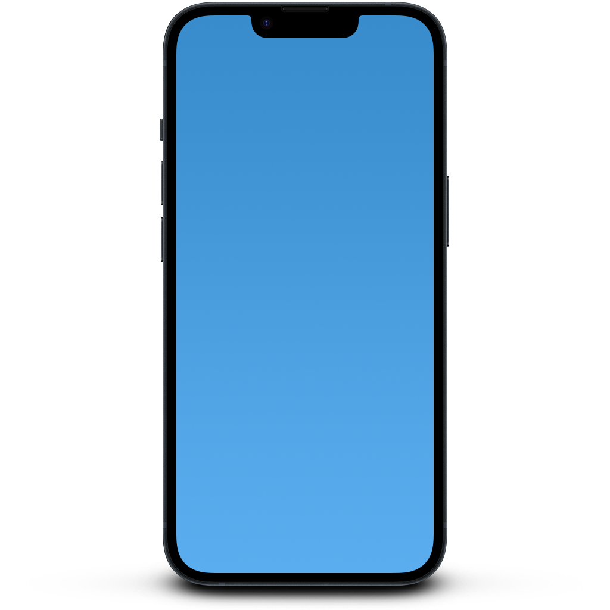

# UTTypeHardwareIcons
Getting hardware icons on macOS


## Requirements

macOS 11 Big Sur

## Examples

### The icon of the current Mac

- SwiftUI:
```swift
Image(deviceModel: .current) // Size defaults to 24x24
Image(deviceModel: .current, size: CGSize(width: 24, height: 24))
```

- AppKit:
```swift
NSImage(deviceModel: .current) // Size defaults to 24x24
NSImage(deviceModel: .current, size: CGSize(width: 64, height: 64))
```


### MacBook Pro M2 Pro/Max aka. Mac14,6



- SwiftUI:
```swift
Image(deviceModel: "Mac14,6", size: CGSize(width: 512, height: 512))
```

- AppKit:
```swift
NSImage(deviceModel: "Mac14,6", size: CGSize(width: 512, height: 512))
```

iPhone 14 aka. iPhone14,7



- SwiftUI:
```swift
Image(deviceModel: "iPhone14,7", size: CGSize(width: 512, height: 512))
```

- AppKit:
```swift
NSImage(deviceModel: "iPhone14,7", size: CGSize(width: 512, height: 512))
```
